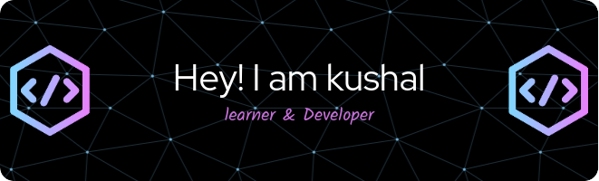

  <table>
    <tr>
      <td>
        

          
        

        <h2 align="center">Hi there, I'm Kushal Chaulagain 👋</h2>
        
Welcome to my GitHub profile! I'm a passionate developer with a strong interest in coding and problem-solving. I enjoy building innovative projects and exploring new technologies.

      </td>
      <td>
        

          
        

        <h3 align="center">Skills</h3>
        <ul align="center">
          <li>Programming languages: 
             
             
             
             
          <li>Web development: 
             
             
             
             
            
            
          <li>Version control: 
             
             
             
        </ul>
      </td>
    </tr>
  </table>

